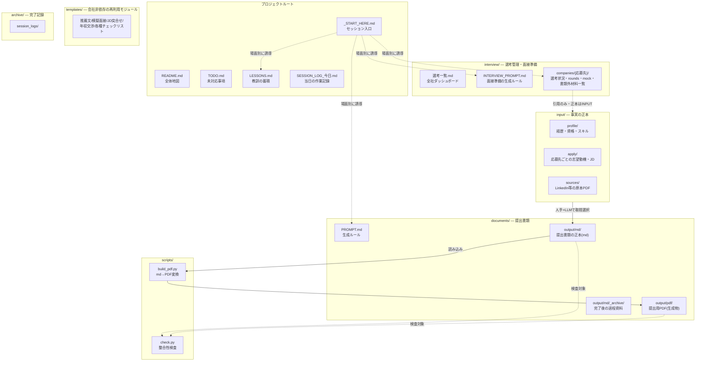
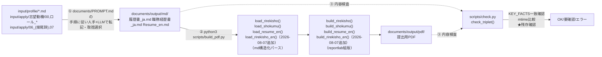
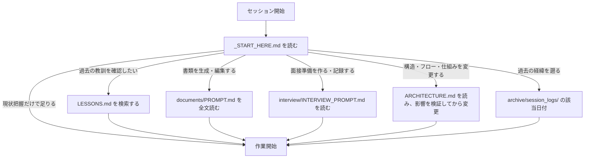
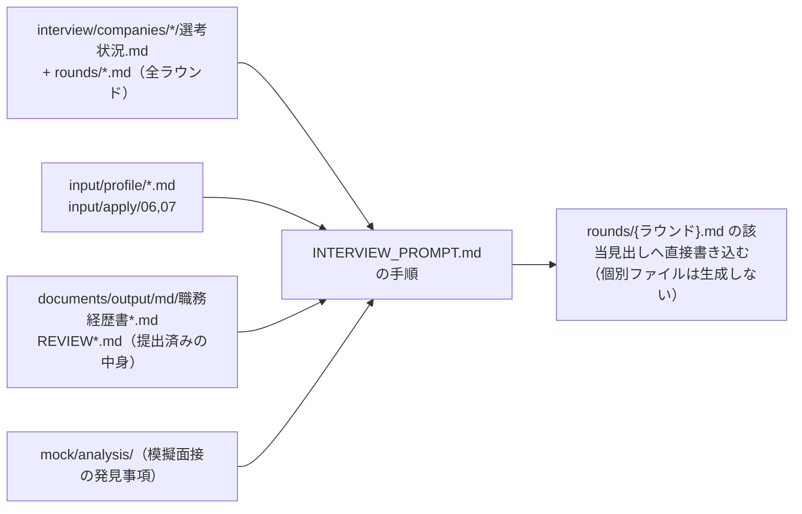
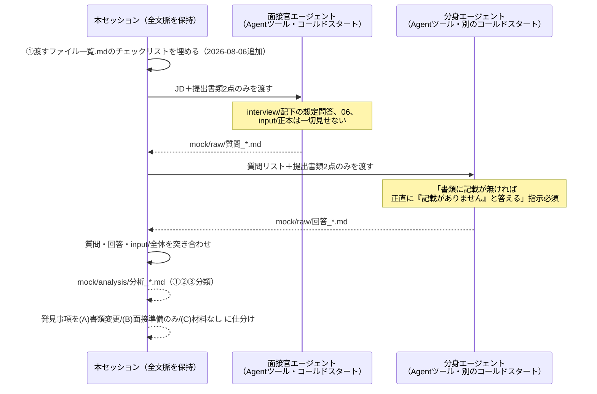

# ARCHITECTURE.md — 構成・データフロー・ソフトウェア工学的レビュー

> **これはテンプレート版です。** 元プロジェクトの開発過程で見つかった具体的な不具合・修正履歴（日付・件数つきの詳細な経緯）は、個人が特定できる情報や元プロジェクト固有の経緯を含むため取り除いてあります。**構成図・データフロー図（1〜3節）は現状のまま普遍的に使えます。ソフトウェア工学的レビュー（4節）は、あなたが自分のプロジェクトを見直すときに使うための「観点の型」だけを残しています。**
>
> ⚠️ **恒久ルール**: 構造・フロー・仕組みに関わる変更（`scripts/`の挙動、mdの見出し構造、出力先ディレクトリ等）を行う前に、必ず本ファイルを参照して現状を確認し、変更が既存のデータフロー・依存関係にどう影響するかを検証してから実装に入ってください（「変更してから確認」ではなく「確認してから変更」）。**構造を変更したら、同じ作業の中で本ファイルも更新してください**（「承認された」ことと「実際にファイルに反映されている」ことは別です——後で直そうとして忘れることがあります）。

---

## 1. 構成図 — ディレクトリと責務

**各層の責務（何を持ち、何を持たないか）**

| ディレクトリ | 持つもの | 持たないもの |
|---|---|---|
| `input/` | 経歴・資格・志望動機・JDの**正本**。詳細・網羅性を優先 | 提出用に取捨選択された文章、面接での語り方 |
| `documents/output/md/` | 提出書類そのもの（**単一の情報源**、PDFはここから機械生成） | 正本の全詳細（`input/`から取捨選択済み）、解釈・意味づけ |
| `documents/output/pdf/` | mdから機械生成された成果物のみ | 独自の文言（mdを直接編集すれば足りる） |
| `input/apply/志望動機/`（2026-08-07新設）＋`input/apply/06_志望動機_希望条件_{接尾辞}.md` | 志望動機の**解釈・意味づけ・語り方の方針**。3層構成——`志望動機/00_不変の軸.md`（全応募共通）／`志望動機/ロール_{職種}.md`（職種別、⚠️職種間で内容が矛盾するため共存不可）／`06_志望動機_希望条件_{接尾辞}.md`（企業別、応募先ごとに複数共存） | 客観的な経歴事実（`input/profile/`側） |
| `interview/companies/*/rounds/` | ラウンドごとの想定問答・実施記録 | 書類に無い横断的な面接材料（`書類外材料一覧.md`側） |
| `interview/companies/*/書類外材料一覧.md` | 面接直前専用の自己完結チートシート（例外的に重複を許容） | 提出書類に既に書かれている事実 |
| `interview/companies/*/mock/` | 模擬面接の生データ（`raw/`）と分析結果（`analysis/`） | 本番の実施記録（`rounds/`側） |
| `scripts/` | md→PDF変換、整合性検査 | 文章の内容判断（コードは文言を一切変更しない） |
| `templates/` | 会社非依存の**手順・判断フレーム** | 本プロジェクト固有の氏名・金額・応募先事情 |
| `archive/`、`documents/output/md/_archive/` | 完了・過去の記録（削除ではなく移動） | 現在進行中の作業対象 |

---

## 2. データフロー図（最重要）

### 2-1. 提出書類の生成フロー（`input/` → `documents/` → PDF）

⚠️ **①は自動化されていない。** `input/`の変更が`documents/`に反映されたかは人間が判断・実行する（意図的な分離のため、アーキテクチャでは解決できない。運用上のチェックでカバーするしかない）。
⚠️ **②のパース（`load_shokumu()`等）は、md内の見出し文字列に構造的に依存する。** 詳細は「5-3. 結合度」参照。

### 2-2. `build_pdf.py`の入出力（ファイルレベル）

| 関数 | 読む | 書く |
|---|---|---|
| `build_fonts()` | `documents/`・`interview/`・`input/`配下の全md（使用文字集合の収集のみ） | `scripts/fonts/*.ttf`（フォントキャッシュ） |
| `_discover_suffixes()`（2026-08-07新設） | `documents/output/md/`に実在する`履歴書_*_ja.md`／`職務経歴書_*_ja.md`／`Resume_*_en.md`／`履歴書_*_en.md`の4パターンから接尾辞を自動検出 | — |
| `_md_paths(suffix)`（2026-08-07新設） | — | 接尾辞から4書類のmdパスを組み立てる（ファイル名の組み立てロジックの単一集約点） |
| `load_rirekisho(suffix)` | `_md_paths(suffix)["rirekisho"]`（**2026-08-07: ハードコード解消済み**） | — |
| `load_shokumu(suffix)` | `_md_paths(suffix)["shokumu"]`（同上） | — |
| `load_resume_en(suffix)` | `_md_paths(suffix)["resume_en"]`（同上） | — |
| `load_rirekisho_en(suffix)`（2026-08-07追加） | `_md_paths(suffix)["rirekisho_en"]`（同上）。JIS履歴書の構造をそのまま英訳した版——`Resume_en`（ATS形式）とは別物 | — |
| `build_*(path, suffix)` | 上記`load_*(suffix)`の戻り値（構造化データ） | `documents/output/pdf/*.pdf` |
| `__main__`ブロック | `_discover_suffixes()`の結果をループし、接尾辞ごとに存在する`load_*`/`build_*`だけを呼ぶ | 複数応募先の`documents/output/md/`が同時に存在していれば、全応募先分のPDFを1回の実行で生成する |

**⚠️ 2026-08-06追加（fail-loud化）**: 各`load_*()`は`secs = _split_h2(raw)`直後に`_assert_h2_set()`（`load_shokumu()`はさらに`cert_subs`に対する`_assert_cert_subs()`、会社セクション数に対する`len(companies)==3`assert）を呼び、**md側の見出し構成がコードの想定と一致しないと即座に`RuntimeError`で停止する**ようにした（見出し名⇔内部keyの対応表は`build_pdf.py`冒頭の`RIREKISHO_H2`/`SHOKUMU_H2`/`RESUME_EN_H2`等）。これにより「見出し名依存」という結合自体は無くなっていないが、**不整合が静かに描画から漏れる（今日発生しかけた事故）ではなく、必ず気づける形に変わった**。初回実行で実際に`履歴書_ja.md`の「通勤・扶養家族」セクションが未対応（描画コードが存在せず、PDFから完全に欠落していた）と検出され、その場で修正した（詳細: 4-3参照）。**⚠️ 2026-08-07: 2度目の実地検証。** `履歴書_ja.md`にJIS標準項目「賞罰・健康状態」を追加した際、意図的に「コードの対応表に追加し忘れた場合」を再現したところ、`_assert_h2_set()`が実際に「未知の見出し(##)が見つかりました: ['賞罰・健康状態']」を検出することを確認した（fail-loud機構が実際に機能する設計であることの再実証）。

### 2-3. `check.py`の検査対象

| チェック関数 | 対象 | 実際に機能しているか |
|---|---|---|
| `check_triplet(DOC_OUT, "応募書類")` | `documents/output/md/*.md` と対応する `pdf/*.pdf` | ✅ 機能している（実測: OK） |
| ~~`check_triplet(INT_OUT, "面接準備")`~~ | ~~`interview/output/`（実在しないパス）~~ | **削除済み**（死コードだった） |
| `check_chronology()` | `documents/output/md/履歴書*.md`の学歴・職歴・資格年月（2026-08-07: 英語版の見出しにも対応、「免許・資格」先頭行が運転免許なら時系列チェック対象外にする特例を追加） | ✅ 機能している。特例は意図的に不一致を作る実測で検証済み |
| `check_input()` | `input/**/*.md`の★残存・証明写真の有無 | ✅ 機能している |
| `check_expiry()` | `input/profile/03_免許資格.md`の期限日付 | ✅ 機能している |
| `check_status_sync()`（2026-08-06新設） | `interview/選考一覧.md`のSTATUS-MAPコメントと各社`選考状況.md`のSTATUSコメントの一致 | ✅ 機能している（意図的に不一致を作って検出することを確認済み——検証ロジックは一度壊して確かめないと信用できない） |

### 2-4. セッション開始時の読み込みフロー（`_START_HERE.md`経由）

### 2-5. 面接準備時の読み込みフロー

⚠️ 2026-08-06、`INTERVIEW_PROMPT.md`を実態に合わせて全面改訂した（旧版は`output/{md,html,pdf}`への個別ファイル生成を想定していたが、一度も使われず、`rounds/*.md`への直接編集が実際の運用だった。詳細は「4-4. 単一障害点」参照）。以下は改訂後の実態と一致したフロー。

### 2-6. 模擬面接モジュールの3ステップ（隔離の境界線）

⚠️ 2026-08-06、隔離の徹底を「主セッションが毎回プロンプトに書く記憶」から、`templates/模擬面接ジェネレータ/渡すファイル一覧.md`という固定チェックリストに変更した（全項目にチェックが入るまでAgentツールを呼ばない運用）。以下の①は追加されたチェックリスト工程。

---

## 3. 各成果物のライフサイクル

| 成果物 | 生まれる場所 | 更新のタイミング | 完了後の扱い |
|---|---|---|---|
| 経歴・資格の事実 | `input/profile/*.md` | 本人へのヒアリングの都度 | アーカイブしない（正本は常に生き続ける） |
| 志望動機・解釈（不変の軸） | `input/apply/志望動機/00_不変の軸.md` | 本人について新しい発見があった時（低頻度） | アーカイブしない |
| 志望動機・解釈（職種別） | `input/apply/志望動機/ロール_{職種}.md` | 「なぜこの職種か」を磨き上げる都度 | 職種を使い終えても残す（他社で再利用しうる） |
| 志望動機・解釈（企業別） | `input/apply/06_志望動機_希望条件_{接尾辞}.md` | 模擬面接等で実態が判明した都度 | 旧版は`06_志望動機_希望条件_{接尾辞}_旧版archive.md`へ切り出し |
| 提出書類（md） | `documents/PROMPT.md`の生成手順 | `input/`変更時に手動転記（自動反映されない） | 提出後もmdは残す（次の応募・追記の土台） |
| 提出書類（PDF） | `scripts/build_pdf.py` | mdを編集し再実行するたび | 上書きのみ。**提出時点のスナップショットは別途保存されていない**（後述5-4で言及） |
| 面接ラウンド記録 | `interview/companies/*/rounds/*.md`（`_template/`由来） | 準備時と実施後の2段階で更新 | 全ラウンド終了後もそのまま参照され続ける |
| 模擬面接・生データ | `mock/raw/`（Agentツールの出力） | 実施時点の1回のみ（不変のスナップショット） | 日常参照はしない。逐語確認が要る時だけ開く |
| 模擬面接・分析 | `mock/analysis/`（本セッションが作成） | 発見事項を`rounds/`や`input/`へ反映した後は不変 | 日常参照の対象（軽量） |
| 書類外材料一覧 | 面接直前に1回集約生成 | 新しい材料が判明するたび追記 | 選考終了まで生き続ける |
| `SESSION_LOG_YYYY-MM-DD.md` | 当日の作業中に追記 | その日のうちのみ | 日付が変わったら`archive/session_logs/`へ |
| `LESSONS.md` | 日次クロージング時、再利用可能な教訓を抽出 | 教訓が増えるたびに追記のみ | アーカイブしない（永続的知識ベース） |

---
## 4. ソフトウェア工学の観点でのセルフレビュー（自分のプロジェクトを見直すときの型）

プロジェクトが育ってくると、最初の設計が実態に合わなくなることがあります。定期的に、以下の観点で見直すと発見があります（元プロジェクトでは、実際にこの観点の見直しから複数の実装ミスが見つかりました）。

### 4-1. 単一責任（Single Responsibility）
1つのファイル・1つの関数が、複数の異なる責務を同居させていないか。`scripts/build_pdf.py`は「フォント処理」「mdパース」「PDFレイアウト」「文書別レンダリング」を1ファイルに同居させています。改修頻度が低いうちは実害が無いことが多いですが、規模が大きくなったら分割を検討してください。

### 4-2. DRY と意図的重複の区別
同じ情報が複数箇所にあるとき、それは「直すべき重複」か「意図的な分離」か。`input`（正本）と`documents`（提出用の取捨選択）の分離は**意図的な重複**であり、統合すべきではありません。一方、`選考一覧.md`と各社`選考状況.md`のように「同じ事実を2箇所に書く」構造は、書き忘れによるドリフト（食い違い）が起きやすいため、機械照合の仕組み（`check.py`の`check_status_sync()`のような）を検討する価値があります。

### 4-3. 結合度
コードがmdの見出し名の文字列一致に依存していないか。依存している場合、見出し名を変えると静かに描画から漏れる事故が起きやすい構造です。`build_pdf.py`は`_assert_h2_set()`等で「mdとコードの想定が食い違ったら即座に例外で停止する」設計にしてあります（fail-loud）。新しい見出しを追加するときは、この検証にも対応が必要かを確認してください。

### 4-4. 単一障害点（SPOF）
ドキュメントに書かれた仕様と、実際のコードの動作が食い違っている箇所がないか。「ドキュメントには書いてあるが実装されていない機能」は、fail-loudなassertでは検出できない種類のギャップです（見出し構造は正しくても、その先の描画コードが実装されていないケース）。定期的に「ドキュメント記載の機能を実際に動かして確認する」ことを勧めます。

### 4-5. 検証可能性
「対応した」「反映した」という報告を、実際にファイルの中身をgrep等で確認してから行っているか。承認と実装の間には、忘れる余地があります。

### 4-6. 拡張性
新しい応募先・新しい職種を追加するとき、コード変更が必要な箇所はどこか。`documents/output/md/`に実在するファイルから接尾辞を自動検出する設計（`_discover_suffixes()`）にしてあるため、新しい接尾辞を追加してもコード変更は不要です。志望動機も3層構成（不変の軸／職種別／企業別）にしてあり、矛盾する内容を1ファイルに同居させない設計です。

---

## 5. 見直しのタイミング

- 新しい応募先・新しい職種を追加するとき（拡張性の観点が特に効きます）
- `input/`や`documents/output/`のmd見出し構造を変えるとき（結合度の観点）
- 「あれ、前にも似た修正をした気がする」と感じたとき（DRY・単一障害点の観点）

見直して分かったことは、この`ARCHITECTURE.md`に追記してください。「提案」と「対応済み」を区別し、対応済みのものは日付を添えて残しておくと、後から経緯を追えます。
